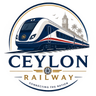

<div align="center">



# Ceylon Railway

### AI-Driven Intelligent Railway Operations System for Sri Lanka

**SLIIT · Faculty of Computing · IT4010 Research Project · Group R26-IT-127**

*An academic research showcase exploring AI-powered and optimization-based approaches to smarter railway operations.*

[](#project-overview)
[](#technology-stack)
[](https://ceylon-railway.vercel.app)

**[🌐 Live Website](https://ceylon-railway.vercel.app)** · **[GitHub Repository](https://github.com/Vishwaa8/R26-IT-127-Research-Website)** · **Submission: ZIP Archive**

</div>

---

## Project Overview

**Ceylon Railway** is a research showcase website for the **AI-Driven Intelligent Railway Operations System**, undertaken by research group **R26-IT-127** at the Sri Lanka Institute of Information Technology (SLIIT).

The overall research explores how AI, real-time operational information, predictive analytics, and optimization techniques can contribute to better-informed railway decisions in Sri Lanka. It comprises four individual research components addressing ticket fraud, train tracking and delays, scheduling, and passenger demand and capacity management.

> **Academic disclaimer:** This website presents a university research project. It is **not** an official Sri Lanka Railways website or a live railway operations platform. Descriptions of proposed methods and expected outcomes should not be interpreted as independently validated operational performance.

## Research Objectives

- Investigate intelligent methods for detecting suspicious ticket usage and supporting risk-aware passenger verification.
- Explore GPS/IoT-informed real-time train tracking and probabilistic delay prediction.
- Examine multi-objective optimization for train scheduling and capacity management.
- Study spatio-temporal passenger demand forecasting and adaptive seat allocation.
- Present the research scope, methodology, timeline, resources, and team in an accessible website.

## Research Components

| No. | Individual Research Component | Researcher | Student ID |
|:---:|---|---|---|
| 01 | **Multi-Objective Train Scheduling and Capacity Management** | N.K.B.N.N. Narasinghe | IT22217240 |
| 02 | **Intelligent Real-Time Train Tracking and Probabilistic Delay Prediction** | C.S. Didulantha | IT22051202 |
| 03 | **Advanced Intelligent Ticket Fraud Detection and Risk-Aware Passenger Verification** | Muthukudaarachchi V.U | IT22126610 |
| 04 | **Spatio-Temporal Demand Forecasting and Adaptive Seat Allocation** | D.M.N.T. Senevirathna | IT22151506 |

### Research Areas

**Ticket Fraud Detection and Passenger Verification:** Investigates anomaly detection, suspicious ticket reuse, concession misuse, fraud-risk assessment, and risk-aware verification. Research methods include Isolation Forest, One-Class SVM, and autoencoders.

**Train Tracking and Delay Prediction:** Explores railway location information, GPS/IoT-based monitoring, arrival estimation, and probabilistic delay prediction using machine-learning approaches.

**Train Scheduling and Capacity Management:** Studies multi-objective scheduling optimization and capacity planning under operational constraints.

**Passenger Demand Forecasting and Seat Allocation:** Investigates demand patterns across stations and time, forecasting methods, and adaptive seat-allocation strategies.

> The website is an **informational research showcase**. It does not itself run all four research models or provide a real-time operational railway service.

## Website Features

- **Home:** Railway-themed hero section and project introduction.
- **Research Overview:** Introduction to all four components.
- **Research Domain:** Problem background, research gaps, proposed contributions, methodology, and expected outcomes.
- **Research Milestones:** Planned project stages and a compact, clickable Gantt chart.
- **Research Documents:** Project Charter, individual research proposals, and four individual theses with View PDF and Download options.
- **Presentations:** Proposal, PP1, and PP2 presentation PDFs; final presentation marked as forthcoming until available.
- **Research Team:** Supervisor, co-supervisor, and all four student researchers, including profile photographs.
- **Contact:** Supervisor and researcher email contacts.
- **Responsive Design:** Desktop, tablet, and mobile layouts.
- **Light/Dark Theme:** Appearance selection saved using browser `localStorage`.

## Technology Stack

| Area | Technologies / Tools |
|---|---|
| Structure | HTML5 |
| Styling | CSS3, Flexbox, CSS Grid, media queries, CSS custom properties |
| Interactivity | Vanilla JavaScript |
| Theme persistence | Browser `localStorage` |
| Development | Visual Studio Code, Live Server |
| Version control | Git, GitHub, GitHub Desktop |
| Hosting | Vercel |
| University submission | ZIP archive |

**Architecture:** Static frontend website. No backend server, database, package installation, or build process is required to view it locally.

## Project Structure

```text
R26-IT-127-Research-Website/
├── assets/
│   ├── images/
│   │   ├── ceylonrail-logo.png
│   │   ├── ceylonrail-hero.jpg
│   │   ├── research-gantt-chart.jpg
│   │   ├── supervisor.jpeg
│   │   ├── co-supervisor.jpeg
│   │   ├── narasinghe.jpg
│   │   ├── didulantha.jpg
│   │   ├── muthukudaarachchi.PNG
│   │   └── senevirathna.jpg
│   └── icons/                 # Optional; may be empty or omitted
├── css/
│   └── style.css
├── documents/
│   ├── project-charter/
│   │   └── project-charter.pdf
│   ├── proposals/
│   │   ├── didulantha-proposal.pdf
│   │   ├── muthukudaarachchi-proposal.pdf
│   │   └── senevirathna-proposal.pdf
│   └── thesis/
│       ├── narasinghe-thesis.pdf
│       ├── didulantha-thesis.pdf
│       ├── muthukudaarachchi-thesis.pdf
│       └── senevirathna-thesis.pdf
├── presentations/
│   ├── proposal.pdf
│   ├── pp1.pdf
│   └── pp2.pdf
├── index.html
└── README.md
```

**Important:** The tree above is the **intended updated structure** after adding all four thesis PDFs. Ensure the files actually exist before publishing or submitting the website. Paths and filename capitalization must match references in `index.html` exactly. Narasinghe's individual proposal and the final presentation are not listed as available because their files have not been confirmed.

## Live Website

**Production website:** [https://ceylon-railway.vercel.app](https://ceylon-railway.vercel.app)

The website is deployed on Vercel from the GitHub repository's `main` branch. Pushing updates to `main` triggers a new deployment. Deployment does **not** replace the university's required ZIP submission.

## Run the Website Locally

1. Download or extract the website ZIP, or clone the repository:

   ```bash
   git clone https://github.com/Vishwaa8/R26-IT-127-Research-Website.git
   ```

2. Open the `R26-IT-127-Research-Website` folder.
3. Open `index.html` directly in a modern browser. For development, open the folder in **Visual Studio Code** and run it using the **Live Server** extension.
4. Keep relative directory paths unchanged so CSS, images, PDFs, and other assets load properly.
5. Test navigation, document downloads, the Gantt chart, team photos, and theme switching.

No `npm install`, database setup, or build command is necessary.

## Research Documents and Presentations

### Project Documentation

- [Project Charter](documents/project-charter/project-charter.pdf)
- [Project Gantt Chart](assets/images/research-gantt-chart.jpg)

### Individual Research Proposals

- [C.S. Didulantha — Proposal](documents/proposals/didulantha-proposal.pdf)
- [Muthukudaarachchi V.U — Proposal](documents/proposals/muthukudaarachchi-proposal.pdf)
- [D.M.N.T. Senevirathna — Proposal](documents/proposals/senevirathna-proposal.pdf)
- **N.K.B.N.N. Narasinghe — Proposal:** Pending availability.

### Individual Theses

- [N.K.B.N.N. Narasinghe — Thesis](documents/thesis/narasinghe-thesis.pdf)
- [C.S. Didulantha — Thesis](documents/thesis/didulantha-thesis.pdf)
- [Muthukudaarachchi V.U — Thesis](documents/thesis/muthukudaarachchi-thesis.pdf)
- [D.M.N.T. Senevirathna — Thesis](documents/thesis/senevirathna-thesis.pdf)

### Presentation Slides

- [Proposal Presentation](presentations/proposal.pdf)
- [Progress Presentation 1 (PP1)](presentations/pp1.pdf)
- [Progress Presentation 2 (PP2)](presentations/pp2.pdf)
- **Final Presentation:** Coming soon.

> **Publication note:** Only publish proposals, theses, and other academic materials after confirming permission from their authors and compliance with university requirements. If an uploaded thesis is still a draft, identify it as a *draft* rather than a formally approved final thesis. The links above will work only when the corresponding files exist in the repository.

## Research Timeline

The website provides a visual Gantt chart alongside key **planned** milestones:

| Milestone | Planned Date |
|---|---|
| Group registration | 20 October 2025 |
| TAF submission | 05 January 2026 |
| Proposal report | 15 March 2026 |
| Proposal presentation | 16 March 2026 |
| Progress Presentation 1 | 04–06 May 2026 |
| Website assessment | 11 October 2026 |
| Progress Presentation 2 | 12–14 October 2026 |
| Final presentation and viva | 01 December 2026 |
| Final report | December 2026 (exact day not stated in chart) |

*Dates are transcribed from the project's planning Gantt chart and may differ from updated official assessment notices.*

## Research Team and Contacts

### Academic Supervisors

| Role | Name | Email |
|---|---|---|
| Supervisor | Ms. Chathurangika Kahandawaarachchi | [chathurangika.k@sliit.lk](mailto:chathurangika.k@sliit.lk) |
| Co-Supervisor | Mr. Uditha Dharmakeerthi | [uditha.d@sliit.lk](mailto:uditha.d@sliit.lk) |

### Student Researchers

| Member | Student ID | Email |
|---|---|---|
| N.K.B.N.N. Narasinghe | IT22217240 | [it22217240@my.sliit.lk](mailto:it22217240@my.sliit.lk) |
| C.S. Didulantha | IT22051202 | [it22051202@my.sliit.lk](mailto:it22051202@my.sliit.lk) |
| Muthukudaarachchi V.U | IT22126610 | [it22126610@my.sliit.lk](mailto:it22126610@my.sliit.lk) |
| D.M.N.T. Senevirathna | IT22151506 | [it22151506@my.sliit.lk](mailto:it22151506@my.sliit.lk) |

## Responsive Design and Final Testing

Recommended viewport checks:

- **Desktop:** 1440 × 900
- **Tablet:** 768 × 1024
- **Mobile:** 390 × 844 and 440 × 956

Before submission, verify that headings and cards remain readable, navigation and buttons are usable, no unintended horizontal scrolling occurs, PDFs open and download successfully, photographs display, and both themes work as expected.

## ZIP Submission

The official university submission is a **ZIP archive containing the complete website**. Vercel is an optional live preview, not a replacement for the archive.

1. Save the latest `index.html`, `css/style.css`, and `README.md`.
2. Confirm that required images, Project Charter, proposal PDFs, thesis PDFs, and presentation PDFs are present.
3. Remove development-only folders such as `.git/`, `.vscode/`, and temporary files from the **submission copy**.
4. Compress the project folder as `R26-IT-127-Research-Website.zip`, unless a different filename is required by the submission portal.
5. Extract the ZIP into another location, open `index.html`, and test the website again.
6. Check the archive against any university size limit and submission instructions before uploading.

## Contact

For academic or project-related inquiries, contact the [supervisor](mailto:chathurangika.k@sliit.lk), [co-supervisor](mailto:uditha.d@sliit.lk), or a student researcher using the email addresses above. No external research-profile links are required.

---

<div align="center">

**Ceylon Railway · Research Group R26-IT-127**  
**Sri Lanka Institute of Information Technology (SLIIT)**

*Smarter decisions for the future of railway operations.*

</div>
